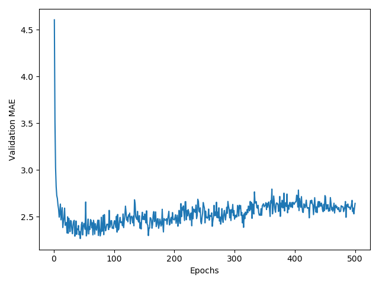
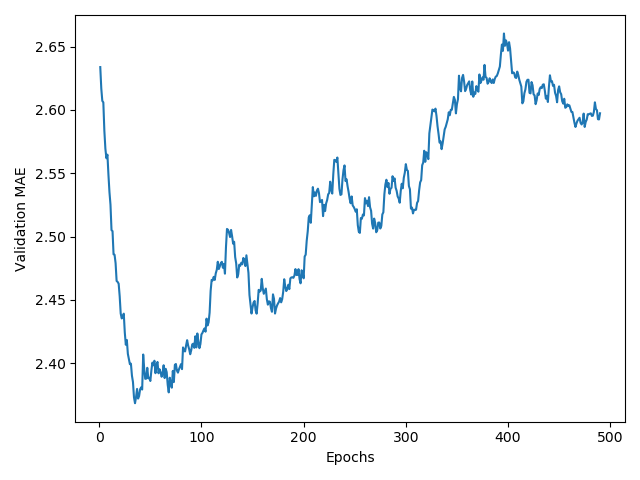

# Boston Housing Price Predictor

This is a neural network to predict Boston housing prices using the using the [Keras](https://keras.io/) deep learning library on top of TensorFlow.

This is my first attempt at a regression problem instead of a classification problem - meaning predicting a continuous value instead of a discrete value. I used Francois Chollet's book "Deep Learning with Python" as a tutorial.

I'm using the Boston housing dataset included with Keras. It contains 13 attributes of houses at different locations around the Boston suburbs in the 1970s such as crime rate, tax rate, accessibility to highways, average number of house rooms, etc. The attributes are described [here](http://lib.stat.cmu.edu/datasets/boston). I tried to predict the median price of homes in a given suburb (with prices not adjusted for inflation). The targets are in thousands of dollars, i.e. 15.2 is $15200. 

The data for each attribute comes in different ranges. Here's the first row of the dataset:

`[  1.23247,   0,       8.14,     0,        0.538,     6.142,    91.7,
   3.9769,    4,      307,       21,     396.9,     18.72   ]`

The different ranges would make learning difficult, so I started by doing a **feature-wise normalization**. Meaning for each feature in the input data, I subtracted the mean of the feature and divided by the standard deviation. That way everything would be centered around 0 and have a unit standard deviation.

It's a very small dataset with only 506 data points - 404 for training and 102 for testing. Because there aren't many data points, I used a small network with only two hidden layers - each with 64 units.

There is no activation function because in a **scalar regression** problem like this, we want the model to be free to predict any value - not constrain the range like in classification. 

I used a **mean squared error** (MSE) loss function and monitored the **mean absolute error** (MAE) during training.

Because the dataset was so small, I couldn't easily break up the training data to have a validation set. With so few data points, the validation scores could have varied wildly with which data points ended up in the validation set. So instead I used **K-Fold Validation** - where the data set gets broken into K partitions, creating K models, and training each on K-1 partitions while evaluating the other partitions. The validation score is then the average. 

K-Fold Validation Steps:
1. Shuffle the datase
2. Split the data set into k groups
3. For each group:
    1. Make the group a test data set
    2. Make the remaining groups the training data set
    3. Fit a model on the training set and evaluate it on the test set
    4. Keep the evaluation score and discard the model
5. Average the evaluation scores.

With k=4 and 100 epochs I got the following values for MAE:
[2.0235395431518555, 2.460193157196045, 2.4647674560546875, 2.5240468978881836]
That comes out to an average of 2.368136763572693. This means I'm off by about $2368 on average. 

I then trained for 500 epochs while keeping track of the MAE to plot it.

I then smoothed the curve by replacing each point with an exponential moving average of the previous points and removing the first 10 points that were on a different scale from the others. 

You can tell from the smoothed graph that it starts overfitting after about 80 epochs. 

Running it for the final time, I got a test MAE score of 2.549101951075535. So on average my model is off by $2549.

Keras version: 2.0.8; Tensorflow version: 1.15

